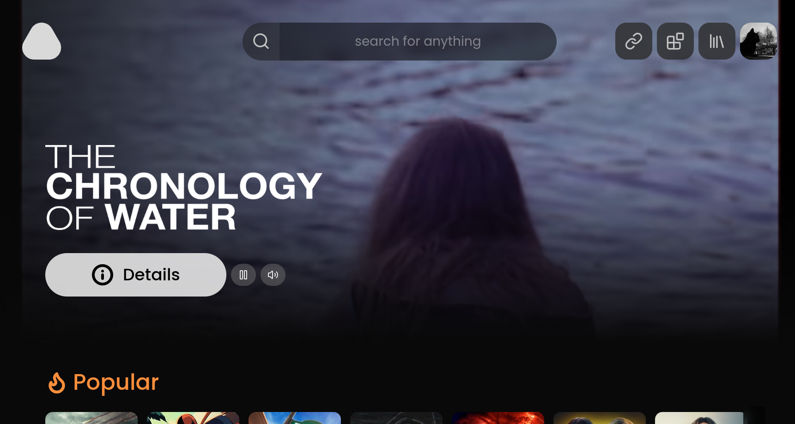

# Raffi

<div align="center">



**A modern, beautiful streaming platform for your personal media library**

[](https://opensource.org/licenses/MIT)
[](https://raffi.al)

[Features](#features) • [Installation](#installation) • [Development](#development) • [Architecture](#architecture) • [Contributing](#contributing)

</div>

---

## Overview

Raffi is a modern, cross-platform streaming application inspired by [Stremio](https://www.stremio.com/), designed to be a faster, more beautiful alternative with enhanced features. Built with modern web technologies, it provides a Netflix-like experience while leveraging the **Stremio addon ecosystem** for content discovery and streaming.

Like Stremio, Raffi uses community addons to aggregate streaming sources, but goes beyond with a reimagined interface, improved performance, and additional features like synchronized watch parties, enhanced progress tracking, and Discord integration.

## Features

### 🎬 **Rich Media Experience**
- Beautiful, responsive UI with smooth animations
- Auto-playing trailers on hover
- Multiple video quality options
- Audio and subtitle track selection
- Picture-in-picture and fullscreen support

### 📱 **Cross-Platform**
- **Windows** - `.exe` and `.msi` installers
- **Linux** - `.deb`, `.rpm`, and `.AppImage` packages  
- **macOS** - `.dmg` and `.zip` distributions
- **iOS & Android** - Mobile companion app (React Native/Expo)

### 👥 **Watch Together**
- Real-time watch parties with synchronized playback
- Chat and presence indicators
- Host controls for play/pause/seek

### 📚 **Library Management**
- Custom lists and collections
- Continue watching with progress tracking
- Episode and season management
- Search across all content

### 🔌 **Stremio Addon Compatibility**
- **Full Stremio addon support** - Use any Stremio addon for content sources
- Community addon ecosystem for movies, TV shows, and more
- Multiple addon sources simultaneously
- Easy addon management and configuration
- Optional direct link mode with user-supplied movie and series URL templates
- Direct links can open as provider embeds or play through Raffi's player when compatible
- Source settings sync with your account while keeping addon and direct configurations separate

### 🎨 **Customization**
- Configurable seek bar styles
- Subtitle delay adjustment
- Theme customization

### 🔧 **Advanced Features**
- Torrent/magnet link streaming
- Local file playback
- Discord Rich Presence integration
- Auto-updater
- Offline mode support

## Installation

### Download

Visit [raffi.al](https://raffi.al) or check the [Releases](https://github.com/kaleidal/raffi/releases) page for the latest version.

#### Windows
- **Installer**: `Raffi-Setup-x.x.x.exe`
- **Portable**: `Raffi-x.x.x.msi`

#### Linux
```bash
# Debian/Ubuntu
sudo dpkg -i Raffi-x.x.x.amd64.deb

# Fedora/RHEL
sudo rpm -i Raffi-x.x.x.x86_64.rpm

# AppImage (Universal)
chmod +x Raffi-x.x.x.AppImage
./Raffi-x.x.x.AppImage
```

#### macOS
- **DMG**: Mount and drag to Applications
- **ZIP**: Extract and move to Applications

## Development

### Prerequisites

- **Node.js** 18+ or **Bun** 1.0+
- **Go** 1.21+ (for server binary)
- **Git**

### Project Structure

```
raffi/
├── apps/
│   ├── desktop/       # Electron desktop shell
│   ├── web/           # SvelteKit + Cloudflare web app
│   └── mobile/        # React Native + Expo
├── packages/
│   ├── app/           # Shared Svelte Raffi UI and app logic
│   ├── shared/        # Platform-agnostic utilities and types
│   └── platform-types/
├── services/
│   ├── sync/          # Cloud sync API (Cloudflare Workers + D1)
│   └── server/        # Local streaming server (Go)
└── marketing/         # Public raffi.al site
```

#### Desktop App (`apps/desktop/`)
- **Framework**: Electron 39 with Svelte 5 and TypeScript
- **Platforms**: Windows, macOS, Linux
- **Features**: Full desktop experience with watch parties, Discord integration, local file playback
- **Build**: electron-builder for multi-platform releases

#### Web App (`apps/web/`)
- **Framework**: SvelteKit with Cloudflare adapter
- **Purpose**: Browser-first Raffi for direct HTTP and debrid streams
- **UI**: Consumes the same shared Svelte package as desktop
- **Installable**: PWA manifest and Cloudflare deployment target

#### Mobile App (`apps/mobile/`)
- **Framework**: React Native with Expo SDK 54
- **Platforms**: iOS and Android
- **Features**: Browse content, search, continue watching, native video playback
- **Sync**: Shares authentication and watch progress with desktop through Raffi Sync
- **Native Module**: Custom torrent-streamer module for on-device streaming

#### Shared App (`packages/app/`)
- **Framework**: Svelte 5
- **Purpose**: The reusable Raffi app experience mounted by desktop and web
- **Playback**: Browser-compatible direct playback where possible, desktop-only gates for local/server-dependent features

#### Sync Service (`services/sync/`)
- **Runtime**: Cloudflare Workers
- **Storage**: Cloudflare D1 for account data and Durable Objects for watch-party state
- **Features**: Ave-authenticated cloud sync, Trakt token integration, watch-party coordination

#### Streaming Server (`services/server/`)
- **Language**: Go
- **Purpose**: HLS transcoding server for video streams
- **Bundled**: Compiled binaries included with desktop app
- **Mobile**: Can be used as remote transcoding server for mobile devices

#### Marketing Site (`marketing/`)
- **Framework**: SvelteKit
- **Purpose**: Marketing site and download page
- **Hosted at**: [raffi.al](https://raffi.al)

### Quick Start

```bash
# Clone the repository
git clone https://github.com/kaleidal/raffi.git
cd raffi

bun install

# Desktop app
bun run dev:desktop

# Web app
bun run dev:web

# Build for production
bun run build:desktop
bun run build:web
```

### Desktop Development

```bash
bun install

# Run in development mode (builds server + starts electron)
bun run dev:desktop

# Run electron only (if server already built)
bun --filter @raffi/desktop electron:dev:only

# Build production release
bun --filter @raffi/desktop dist
```

### Web Development

```bash
bun install

# Start the browser app
bun run dev:web

# Typecheck and build for Cloudflare
bun run check:web
bun run build:web
```

### Mobile Development

```bash
cd apps/mobile

# Install dependencies
bun install

# Start Expo development server
bun run start

# Run on iOS simulator
bun run ios

# Run on Android emulator
bun run android

# Build for production
bunx expo build:ios
bunx expo build:android
```

**Note**: Mobile app requires the desktop server running for torrent streams. Update `STREAMING_SERVER` in `apps/mobile/app/player.tsx` with your local IP.

### Server Development

```bash
cd services/server

# Build server binary
go build -o decoder .

# Run server
./decoder
```

### Website Development

```bash
cd marketing

# Install dependencies
bun install

# Run development server
bun run dev

# Build for production
bun run build
```

## Architecture

### Tech Stack

#### Desktop App
- **Frontend**: Svelte 5, TypeScript, Tailwind CSS
- **Desktop Runtime**: Electron 39
- **Video Player**: HLS.js for adaptive streaming
- **Storage**: Local app data with Raffi Sync cloud backup
- **Build**: Vite + electron-builder
- **Key Libraries**: `@lucide/svelte`, `posthog-js`, `@ryuziii/discord-rpc`

#### Web App
- **Frontend**: SvelteKit, TypeScript, Tailwind CSS
- **Deployment**: Cloudflare Pages/Workers
- **Playback**: Native video and HLS.js for direct HTTP/debrid streams
- **Limitations**: Torrent, local file, export, and local server features stay desktop-only

#### Mobile App
- **Frontend**: React Native (React 19), TypeScript
- **Framework**: Expo SDK 54 with new architecture enabled
- **Video Player**: Expo Video (native)
- **Navigation**: Expo Router (file-based routing)
- **State Management**: Zustand
- **Sync**: Raffi Sync API shared with desktop
- **Native Module**: Custom torrent-streamer for on-device torrenting
- **Key Features**: Tab navigation, dark theme, cross-device sync

#### Sync Service
- **Runtime**: Cloudflare Workers
- **Database**: Cloudflare D1
- **State Coordination**: Durable Objects for active watch parties
- **Auth**: Ave ID tokens verified at the API edge

#### Streaming Server
- **Language**: Go 1.21+
- **Functionality**: HLS transcoding, torrent handling
- **Deployment**: Bundled with desktop, standalone for mobile

### Key Features Implementation

#### Stremio Addon System
- **Compatible with Stremio addons** - Reuses the proven Stremio addon protocol
- Addon discovery and installation
- Multi-source aggregation from different addons
- Torrent/magnet link support via addons
- Community-maintained content catalogs

#### Video Playback
- Custom video player with HLS support
- Multiple quality selection
- Subtitle parsing (SRT/VTT)
- Audio track switching
- Seek bar with time-remaining display

#### Watch Parties
- Synchronized playback state through Raffi Sync
- Durable Object-backed party state
- Host/participant role system
- Automatic reconnection

#### Progress Tracking
- Local and cloud sync
- Per-episode progress
- Resume from last position
- Watched/unwatched states

#### Cross-Device Synchronization
- **Shared authentication** via Ave across desktop, web, and mobile
- **Watch progress sync** - Start on desktop or web, continue on another client
- **Library sync** - Custom lists and favorites across devices
- **Addon settings** - Configured addons available on all platforms

## Building from Source

### Build Desktop App

```bash
# Windows
bun --filter @raffi/desktop dist -- --win

# Linux
bun --filter @raffi/desktop dist -- --linux

# macOS  
bun --filter @raffi/desktop dist -- --mac

# All platforms
bun --filter @raffi/desktop dist
```

Output will be in `apps/desktop/release/`

### Build Mobile App

```bash
cd apps/mobile

# Development builds
bunx expo run:ios       # iOS
bunx expo run:android   # Android

# Production builds (requires EAS account)
bunx eas build --platform ios
bunx eas build --platform android
```

Builds will be available via Expo Application Services (EAS) dashboard.

### Build Configuration

**Desktop** (`apps/desktop/package.json`):
- App metadata (name, version, author)
- Build targets (Windows, Linux, macOS)
- Icon paths and file associations
- Auto-update settings

**Mobile** (`apps/mobile/app.json`):
- App metadata and identifiers
- iOS bundle ID: `al.kaleid.mobile`
- Android package: `al.kaleid.raffimobile`
- Splash screen and icon configuration
- Expo plugins and experiments

## Contributing

Contributions are welcome! Please feel free to submit a Pull Request.

### Development Guidelines

1. **Code Style**: Follow existing patterns, use TypeScript
2. **Commits**: Write clear, descriptive commit messages
3. **Testing**: Test on multiple platforms when possible
4. **Documentation**: Update README for significant changes

### Areas for Contribution

- 🐛 Bug fixes
- ✨ New features
- 🎨 UI/UX improvements
- 📝 Documentation
- 🌍 Translations
- 🧪 Testing

## License

This project is licensed under the MIT License - see the [LICENSE](apps/desktop/LICENSE) file for details.

## Acknowledgments

- Built with ❤️ by [Kaleidal](https://github.com/kaleidal)
- Inspired by [Stremio](https://www.stremio.com/) and its addon ecosystem
- Icons by [Lucide](https://lucide.dev)
- Powered by the community-driven Stremio addon protocol

## Links

- **Website**: [raffi.al](https://raffi.al)
- **GitHub**: [github.com/kaleidal/raffi](https://github.com/kaleidal/raffi)
- **Issues**: [Report a bug](https://github.com/kaleidal/raffi/issues)

---

<div align="center">
Made with Svelte, Electron, and Go
</div>
