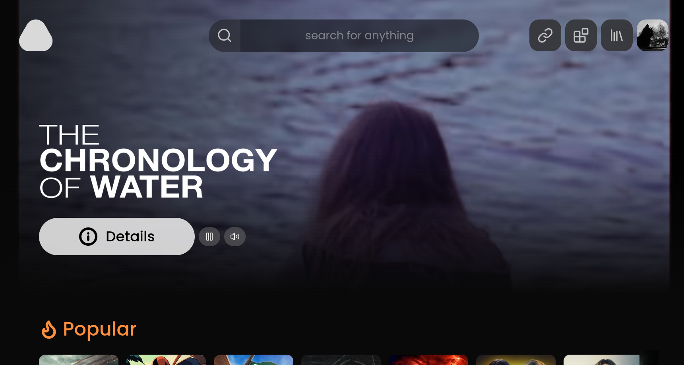

# Raffi

<div align="center">



**A modern, beautiful streaming platform for your personal media library**

[](https://opensource.org/licenses/MIT)
[](https://raffi.al)

[Features](#features) • [Installation](#installation) • [Development](#development) • [Architecture](#architecture) • [Contributing](#contributing)

</div>

---

## Overview

Raffi is a modern, cross-platform streaming application inspired by [Stremio](https://www.stremio.com/), designed to be a faster, more beautiful alternative with enhanced features. Built with modern web technologies, it provides a Netflix-like experience while leveraging the **Stremio addon ecosystem** for content discovery and streaming.

Like Stremio, Raffi uses community addons to aggregate streaming sources, but goes beyond with a reimagined interface, improved performance, and additional features like synchronized watch parties, enhanced progress tracking, and Discord integration.

## Features

### 🎬 **Rich Media Experience**
- Beautiful, responsive UI with smooth animations
- Auto-playing trailers on hover
- Multiple video quality options
- Audio and subtitle track selection
- Picture-in-picture and fullscreen support

### 📱 **Cross-Platform**
- **Windows** - `.exe` and `.msi` installers
- **Linux** - `.deb`, `.rpm`, and `.AppImage` packages
- **macOS** - `.dmg` and `.zip` distributions
- **Web** - Browser app on Cloudflare

### 👥 **Watch Together**
- Real-time watch parties with synchronized playback
- Chat and presence indicators
- Host controls for play/pause/seek

### 📚 **Library Management**
- Custom lists and collections
- Continue watching with progress tracking
- Episode and season management
- Search across all content

### 🔌 **Stremio Addon Compatibility**
- **Full Stremio addon support** - Use any Stremio addon for content sources
- Community addon ecosystem for movies, TV shows, and more
- Multiple addon sources simultaneously
- Easy addon management and configuration
- Optional direct link mode with user-supplied movie and series URL templates
- Direct links can open as provider embeds or play through Raffi's player when compatible
- Source settings sync with your account while keeping addon and direct configurations separate

### 🎨 **Customization**
- Configurable seek bar styles
- Subtitle delay adjustment
- Theme customization

### 🔧 **Advanced Features**
- Torrent/magnet link streaming via Limbo
- Local file playback
- Discord Rich Presence with cover art, playback progress, title context, and Raffi/IMDb links
- Auto-updater
- Offline mode support

## Installation

### Download

Visit [raffi.al](https://raffi.al) or check the [Releases](https://github.com/kaleidal/raffi/releases) page for the latest version.

#### Windows
- **Installer**: `Raffi-Setup-x.x.x.exe`
- **Portable**: `Raffi-x.x.x.msi`

#### Linux
```bash
# Debian/Ubuntu
sudo dpkg -i Raffi-x.x.x.amd64.deb

# Fedora/RHEL
sudo rpm -i Raffi-x.x.x.x86_64.rpm

# AppImage (Universal)
chmod +x Raffi-x.x.x.AppImage
./Raffi-x.x.x.AppImage
```

#### macOS
- **DMG**: Mount and drag to Applications
- **ZIP**: Extract and move to Applications

## Development

### Prerequisites

- **Bun** 1.3+
- **Git**
- **tar** (included with current Windows, macOS, and Linux developer environments)

### Project Structure

```
raffi/
├── apps/
│   ├── desktop/       # Electron desktop shell
│   └── web/           # SvelteKit + Cloudflare web app
├── packages/
│   └── app/           # Shared Svelte Raffi UI and app logic
├── services/
│   └── sync/          # Cloud sync API (Cloudflare Workers + D1)
└── marketing/         # Public raffi.al site
```

#### Desktop App (`apps/desktop/`)
- **Framework**: Electron with Svelte 5 and TypeScript
- **Platforms**: Windows, macOS, Linux
- **Features**: Full desktop experience with watch parties, Discord integration, local file playback
- **Build**: Bun bundles the Electron main/preload processes and electron-builder creates multi-platform releases. Production packages exclude source files, development dependencies, and unused Chromium locales.
- **Playback**: MediaBunny remuxes compatible streams in the renderer. DTS and other unsupported audio streams use a bundled FFmpeg process that copies video and converts only audio to browser-safe multichannel Opus.

Desktop packages pin checksummed Linux x64, Windows x64, and universal macOS binaries from the public [kaleidal/ffmpeg-builds](https://github.com/kaleidal/ffmpeg-builds) repository. `bun --filter @raffi/desktop prepare:ffmpeg` downloads and verifies the artifact for the current platform; `dist` runs this automatically and bundles the executable plus its license and build metadata outside the app ASAR.

Run `bun run validate` from the repository root to typecheck every workspace and run the app and desktop playback suites. The playback fixture verifies Chromium MSE support plus local and HTTP-range playback for stereo AAC and non-default multichannel DTS tracks, including audio switching and playback from a non-zero seek.

#### Web App (`apps/web/`)
- **Framework**: SvelteKit with Cloudflare adapter
- **Purpose**: Browser-first Raffi for direct HTTP and debrid streams
- **UI**: Consumes the same shared Svelte package as desktop
- **Deploy**: Cloudflare Pages/Workers target

#### Shared App (`packages/app/`)
- **Framework**: Svelte 5
- **Purpose**: The reusable Raffi app experience mounted by desktop and web
- **Playback**: Browser-compatible direct playback where possible, desktop-only gates for local/server-dependent features

#### Sync Service (`services/sync/`)
- **Runtime**: Cloudflare Workers
- **Storage**: Cloudflare D1 for account data and Durable Objects for watch-party state
- **Features**: Ave-authenticated cloud sync, Trakt token integration, watch-party coordination

#### Marketing Site (`marketing/`)
- **Framework**: SvelteKit
- **Purpose**: Marketing site and download page
- **Hosted at**: [raffi.al](https://raffi.al)

### Quick Start

```bash
# Clone the repository
git clone https://github.com/kaleidal/raffi.git
cd raffi

bun install

# Desktop app
bun run dev:desktop

# Web app
bun run dev:web

# Build for production
bun run build:desktop
bun run build:web
```

### Desktop Development

```bash
bun install

# Run in development mode
bun run dev:desktop

# Run Electron only (Vite already running)
bun --filter @raffi/desktop electron:dev:only

# Build production release
bun --filter @raffi/desktop dist
```

### Web Development

```bash
bun install

# Start the browser app
bun run dev:web

# Typecheck and build for Cloudflare
bun run check:web
bun run build:web
```

### Website Development

```bash
# Run development server
bun --filter @raffi/marketing dev

# Build for production
bun --filter @raffi/marketing build
```

## Architecture

### Tech Stack

#### Desktop App
- **Frontend**: Svelte 5, TypeScript, Tailwind CSS
- **Desktop Runtime**: Electron
- **Video Player**: native media playback, HLS.js, MediaBunny, and bundled FFmpeg audio conversion
- **Storage**: Local app data with Raffi Sync cloud backup
- **Build**: Vite + electron-builder
- **Key Libraries**: `@lucide/svelte`, `posthog-js`, MediaBunny, and HLS.js

#### Web App
- **Frontend**: SvelteKit, TypeScript, Tailwind CSS
- **Deployment**: Cloudflare Pages/Workers
- **Playback**: Native video and HLS.js for direct HTTP/debrid streams
- **Limitations**: Torrent, local file, and clip export stay desktop-only

#### Sync Service
- **Runtime**: Cloudflare Workers
- **Database**: Cloudflare D1
- **State Coordination**: Durable Objects for active watch parties
- **Auth**: Ave ID tokens verified at the API edge

### Key Features Implementation

#### Stremio Addon System
- **Compatible with Stremio addons** - Reuses the proven Stremio addon protocol
- Addon discovery and installation
- Multi-source aggregation from different addons
- Torrent/magnet link support via addons
- Community-maintained content catalogs

#### Video Playback
- Custom video player with HLS for addon streams
- HTTP/debrid streams play in-app via MediaBunny (probe + remux) or native `<video>` when compatible
- Local files and clip export use MediaBunny on desktop (`raffi-media://` for disk access)
- Torrents stream through Limbo
- Community addon catalog is fetched from Electron main
- Embedded container subtitles are not extracted yet (addon/external subs still work)
- Multiple quality selection
- Subtitle parsing (SRT/VTT)
- Audio track switching
- Seek bar with time-remaining display

#### Watch Parties
- Synchronized playback state through Raffi Sync
- Durable Object-backed party state
- Host/participant role system
- Automatic reconnection

#### Progress Tracking
- Local and cloud sync
- Per-episode progress
- Resume from last position
- Watched/unwatched states

#### Cross-Device Synchronization
- **Shared authentication** via Ave across desktop and web
- **Watch progress sync** - Start on desktop or web, continue on another client
- **Library sync** - Custom lists and favorites across devices
- **Addon settings** - Configured addons available on all platforms

## Building from Source

### Build Desktop App

```bash
# Verify all workspaces and playback paths first
bun run validate

# Windows
bun --filter @raffi/desktop dist -- --win

# Linux
bun --filter @raffi/desktop dist -- --linux

# macOS
bun --filter @raffi/desktop dist -- --mac

# All platforms
bun --filter @raffi/desktop dist
```

Output will be in `apps/desktop/release/`

### Build Configuration

**Desktop** (`apps/desktop/package.json`):
- App metadata (name, version, author)
- Build targets (Windows, Linux, macOS)
- Icon paths and file associations
- Auto-update settings
- Minimal production file allowlist and English Chromium locale

## Contributing

Contributions are welcome! Please feel free to submit a Pull Request.

### Development Guidelines

1. **Code Style**: Follow existing patterns, use TypeScript
2. **Commits**: Write clear, descriptive commit messages
3. **Testing**: Test on multiple platforms when possible
4. **Documentation**: Update README for significant changes

### Areas for Contribution

- 🐛 Bug fixes
- ✨ New features
- 🎨 UI/UX improvements
- 📝 Documentation
- 🌍 Translations
- 🧪 Testing

## License

This project is licensed under the MIT License - see the [LICENSE](apps/desktop/LICENSE) file for details.

## Acknowledgments

- Built with ❤️ by [Kaleidal](https://github.com/kaleidal)
- Inspired by [Stremio](https://www.stremio.com/) and its addon ecosystem
- Icons by [Lucide](https://lucide.dev)
- Powered by the community-driven Stremio addon protocol

## Links

- **Website**: [raffi.al](https://raffi.al)
- **GitHub**: [github.com/kaleidal/raffi](https://github.com/kaleidal/raffi)
- **Issues**: [Report a bug](https://github.com/kaleidal/raffi/issues)

---

<div align="center">
Made with Svelte and Electron
</div>
